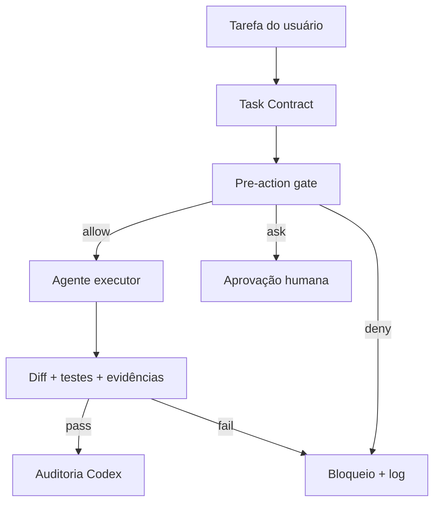

# Agent Governor

Camada universal e determinística de governança para agentes de programação. O agente pode **propor** uma ação; o Governor decide se ela pode ser executada.

> Estado: **v0.1.1/v0.3 (núcleo funcional)**. Integração inicial: Google Antigravity `PreToolUse`. Já existem contratos persistentes, circuit breaker SQLite, recibos fingerprintados, perfis iniciais e diagnóstico/instalação local. Adapters específicos para Codex e Claude continuam no roadmap.

## Por que existe

Arquivos como `AGENTS.md`, `GEMINI.md` e prompts são orientação probabilística. Regras críticas precisam ser verificadas fora do modelo. O Agent Governor combina:

- política universal (comandos destrutivos, bypass de testes, push e dependências);
- contrato limitado para cada tarefa;
- proteção contra modificação do próprio Governor;
- bloqueio antes da ferramenta (`PreToolUse`);
- validação do `git diff` depois da execução;
- log JSONL e circuit breaker para violações repetidas;
- comportamento **fail-closed** quando a configuração está ausente ou inválida.

## Fluxo



## Instalação local

Requer Python 3.11+.

```bash
python -m pip install -e .
governor init /caminho/do/projeto --profile generic
```

Edite `.governor/task-contract.json` antes da tarefa:

```json
{
  "schema_version": 1,
  "task_id": "RIN-042",
  "objective": "Implementar conexão Android com o daemon",
  "allowed_paths": ["android/**", "shared/protocol/**", "tests/**"],
  "forbidden_paths": [".governor/**", "auth/**"],
  "max_files_changed": 8,
  "required_commands": ["./gradlew test", "./gradlew lint"],
  "required_evidence": [],
  "architecture_changes": false,
  "dependency_changes": false
}
```

## Integração com Antigravity

Copie `integrations/antigravity/hooks.json` para `.agents/hooks.json` no projeto governado. Se o Governor estiver instalado apenas no ambiente virtual, ajuste o comando para o executável correto.

Teste o gate sem executar nenhuma ação:

```bash
printf '%s' '{"toolCall":{"name":"run_command","args":{"CommandLine":"git push --force"}}}' | governor hook
```

Resposta esperada:

```json
{"decision":"deny","reason":"[GIT-001] Destructive Git history operation blocked."}
```

O contrato oficial do Antigravity aceita `allow`, `deny`, `ask`, `force_ask` e `deny_unless_prior_grant`. O `hooks.json` registra o Governor para todas as ferramentas.

## Verificação pós-ação

```bash
governor verify --base HEAD~1
```

O comando bloqueia a aprovação quando o diff excede `max_files_changed` ou contém arquivos fora de `allowed_paths`. O comando `validate` executa os comandos declarados e grava recibos fingerprintados em `.governor/evidence/`; alterações posteriores invalidam a prova.

## Segurança e limites da v0.1

- A proteção é tão forte quanto o isolamento do executável e dos arquivos de política. Para uso rigoroso, mantenha a política mestre fora do workspace e somente leitura para o agente.
- Regex de shell não substitui sandbox do sistema operacional. Use também permissões e sandbox nativos do Antigravity.
- `force_ask` depende da interface do Antigravity para obter aprovação humana.
- O Governor não executa comandos propostos; apenas autoriza, pede confirmação ou bloqueia.
- Nenhum código de terceiros foi copiado nesta versão. As fontes abaixo foram usadas como referências arquiteturais e de interface.

## Fontes e projetos estudados

### Documentação primária

- [Google Antigravity — Hooks](https://antigravity.google/docs/hooks): schema de `.agents/hooks.json`, eventos, payload `toolCall` e decisões de `PreToolUse`.
- [Google Antigravity — Permissions](https://antigravity.google/docs/permissions): camada nativa de permissões e precedência de regras.
- [Google Antigravity — Rules](https://antigravity.google/docs/ide/rules): regras globais e de workspace.
- [OpenAI — Harness engineering](https://openai.com/index/harness-engineering/): documentação curta como mapa e invariantes verificáveis no repositório.
- [OpenAI Codex — AGENTS.md](https://developers.openai.com/codex/guides/agents-md/): instruções hierárquicas para projetos auditados pelo Codex.

### Projetos open source

| Projeto | Licença observada | Ideia estudada/aproveitada conceitualmente |
|---|---:|---|
| [toininoi/agent-guard](https://github.com/toininoi/agent-guard) | Apache-2.0 | boundary de autorização, normalização multi-driver, invariantes e eventos |
| [logi-cmd/agent-guardrails](https://github.com/logi-cmd/agent-guardrails) | MIT | task brief, allowed paths, limite de escopo, evidência e review gate |
| [shanraisshan/claude-code-hooks](https://github.com/shanraisshan/claude-code-hooks) | MIT | catálogo e ciclo de vida de hooks |
| [h3rrkent/claude-code-guardrails](https://github.com/h3rrkent/claude-code-guardrails) | licença não encontrada na revisão | defesa em camadas; usado somente como referência pública, sem incorporação de código |

Os projetos `roboticforce/agent-guardrails`, `laundromatic/agent-guardrails` e `google-antigravity/antigravity-sdk-python` foram citados em uma exploração inicial, mas não entram como fonte desta versão porque os endereços ou conteúdos não foram confirmados de forma suficiente durante a implementação. Essa distinção evita atribuir funcionalidade a um repositório errado.

## Roadmap resumido

- **v0.1:** motor fail-closed, contrato, Antigravity hook, scope check, log e circuit breaker.
- **v0.2:** recibos de testes/evidências, perfis Android/Python/Node/n8n, hashes assinados e instalador seguro.
- **v0.3:** adapters oficiais para Codex/Claude/Gemini CLI, auditoria estruturada e CI reutilizável.
- **v1.0:** policy bundles assinados, armazenamento externo append-only e isolamento do Governor fora do workspace.

Veja [ROADMAP.md](docs/ROADMAP.md) e [ARCHITECTURE.md](docs/ARCHITECTURE.md).

## Licença

MIT. Consulte [LICENSE](LICENSE).
